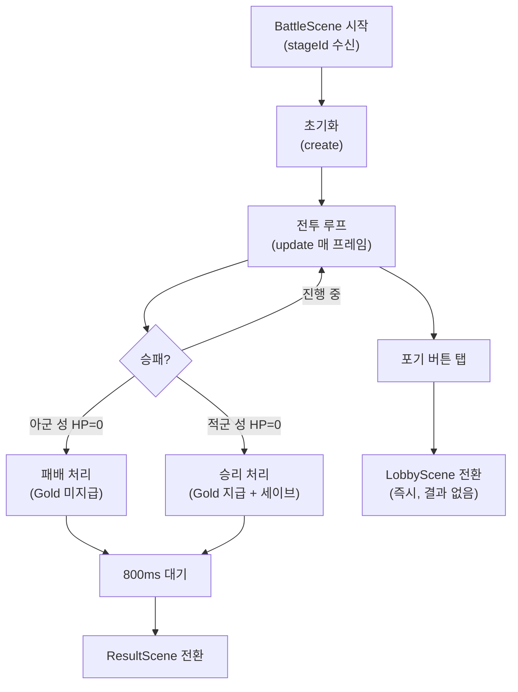

# 전투 기능 명세

> **카테고리:** FEATURES
> **최초 작성:** 2026-03-21
> **최종 갱신:** 2026-03-26
> **관련 기능:** BattleScene, BattleHUD, CostSystem, WaveSystem, Unit, AllyUnit, Hero, Paladin, Castle, ArcProjectile, Projectile

## 개요

전투 씬(BattleScene)의 전체 동작을 명세한다. 유닛 소환, 전투 루프, 영웅 제한 로직, 승패 판정, 결과 처리까지 순서대로 기술한다.

---

## 전투 시작 조건

LobbyScene에서 해금된 스테이지 버튼을 탭하면 `scene.start('BattleScene', { stageId })` 가 호출되어 전투가 시작된다.

BattleScene의 `create()` 진입 시 수행되는 초기화 순서:

1. `SaveSystem.resetHeroUsed()` 호출 — 영웅 사용 플래그를 `false`로 초기화하고 세이브 저장
2. 배경(하늘 + 지면 + 지평선) 렌더링
3. `CostSystem` 인스턴스 생성 (코스트 초기값: **0**)
4. 업그레이드 적용 화살 수치 계산 (아군 성에만 적용)
5. 아군 성 + 적군 성 생성
6. 유닛 배열 초기화 (`allyUnits`, `enemyUnits`, `projectiles`)
7. 성이 서로를 공격 타겟으로 참조 설정
8. `WaveSystem` 생성 및 시작 — 적 소환 타이머 루프 시작
9. `BattleHUD` 생성
10. 조이스틱 생성 (`_aimJoy`, `_moveJoy`)
11. 일시정지 버튼 생성
12. 스테이지 레이블 텍스트 표시

---

## 전투 루프

Phaser의 `update(time, delta)` 가 매 프레임 실행한다. `delta`는 이전 프레임과의 경과 시간(ms)이다.

```
매 프레임:
  1. costSystem.update(delta)       코스트 재생
  2. 죽은 유닛/투사체 배열에서 제거  (alive=false 필터)
  3. allyUnits.forEach → u.update() 아군 유닛 AI
  4. enemyUnits.forEach → u.update() 적군 유닛 AI
  5. projectiles.forEach → p.update() 투사체 이동 + 충돌
  6. hud.update(liveHero)           HUD 갱신
  7. _checkBattleEnd()              승패 판정
```

---

## 코스트 시스템

`CostSystem`은 전투 중에만 사용되는 인스턴스 기반 클래스다.

| 속성 | 값 |
|------|-----|
| 초기값 | **0** |
| 최대값 | 150 (`GameConfig.COST_MAX`) |
| 재생 속도 | 초당 3.6 (`GameConfig.COST_REGEN_RATE = 3.6`, 프로토 3배 적용) |

코스트는 `delta` 기반으로 매 프레임 연속 증가한다. `COST_REGEN_RATE × (delta / 1000)` 만큼 누적되어 최대치(150)를 초과하지 않는다.

### 코스트 획득 경로

| 이벤트 | 획득량 |
|--------|--------|
| 자동 재생 | 초당 1.2 코스트 |
| 적군 유닛 처치 | 처치한 유닛의 `killCostReward` 값 즉시 지급 |

적군 처치 시 코스트 획득 흐름:
```
EnemyUnit.die()
    ↓
Unit.onDie 콜백 실행 (BattleScene이 소환 시 주입)
    ↓
costSystem.gainCost(unit.stats.killCostReward)
    ↓
코스트 즉시 증가 (최대치 150 클램프)
```

처치 보상 수치는 `src/data/units.js`의 `killCostReward` 필드에 정의되어 있다. 유닛별 수치는 `DOCS/BALANCE/UNIT_STATS.md` 참조.

### 유닛별 소환 코스트

| 유닛 | 소환 코스트 |
|------|------------|
| warrior | 5 |
| archer | 8 |
| shielder | 10 |
| mage | 15 |
| knight | 20 |
| paladin | 30 |
| serpent_mage | 40 |
| hero | 100 |

---

## HUD 슬롯 구성

### 유닛 슬롯 (8칸)

HUD 하단에 8개 슬롯이 가로로 배치된다. 프로토타입 모드(`isProto: true`)에서는 8종 유닛 슬롯이 모두 활성화된다.

| 슬롯 인덱스 | 내용 (프로토 모드) |
|-------------|-------------------|
| 0 | warrior |
| 1 | archer |
| 2 | shielder |
| 3 | mage |
| 4 | knight |
| 5 | paladin |
| 6 | serpent_mage |
| 7 | hero (영웅 전용 슬롯) |

영웅은 8번 슬롯(인덱스 7)에 통합되어 일반 유닛 슬롯과 동일한 방식으로 표시된다. 소환 후에는 슬롯이 잠김 처리된다.

### 스킬 슬롯 (6칸)

영웅 소환 후 HUD 우측에 6개 스킬 슬롯이 표시된다.

| 슬롯 인덱스 | 내용 |
|-------------|------|
| 0 | 불화살 (Fire Arrow) |
| 1~5 | 빈칸 (null, 확장 예정) |

각 스킬 슬롯은 파이 차트 방식으로 쿨타임을 표시한다. 12시 방향을 기준으로 시계 방향으로 진행되며, `_cooldownOverlays` 배열로 관리된다.

---

## 조이스틱

가로 모드 전환에 따라 조이스틱이 두 개로 분리되었다. 각 조이스틱은 독립된 입력 역할을 담당한다.

| 조이스틱 | 종류 | 위치 | 조작 |
|----------|------|------|------|
| `_aimJoy` | floating (화면 터치 시 생성 위치에 출현) | 좌측 전투 영역 | 수직 입력 → 화살 조준각 조절 |
| `_moveJoy` | 고정 | 불화살 버튼 위 | 수평 입력 → 카메라 이동 |

조이스틱은 서로의 입력에 간섭하지 않는다. `_aimJoy`는 플레이어가 누른 위치에 즉시 생성(floating)되어 손가락 위치에 구애받지 않는다.

---

## 유닛 소환 흐름

플레이어가 HUD의 유닛 버튼을 탭하면 다음 순서로 처리된다.

```
플레이어 탭
    ↓
BattleHUD.hitZone 'pointerdown'
    ↓
onSummon(unitId) 콜백 → BattleScene._onSummonRequest(unitId)
    ↓
[영웅 중복 검사]
  hero이고 save.heroUsed === true → 즉시 return (소환 불가)
    ↓
[코스트 차감 시도]
  costSystem.spend(unit.cost)
  → false (코스트 부족) → 즉시 return
  → true (차감 성공) → 계속
    ↓
[영웅 플래그 확정]
  유닛이 영웅이면:
    save.heroUsed = true
    SaveSystem.persist()
    hud.markHeroUsed()  ← 영웅 버튼 → 스킬 버튼으로 교체
    ↓
_spawnAlly(unitId)
  → getUnitStats(unitId, save.upgrades)  업그레이드 적용 스탯
  → unitId === 'hero' ? new Hero() : new AllyUnit()
  → allyUnits.push(unit)
```

### 영웅 소환 제한

영웅은 스테이지당 1회만 소환할 수 있다. 제한의 구현 방식:

- `save.heroUsed` 플래그를 전투 시작 시 `false`로 초기화
- 코스트 차감 **성공 후**에 `heroUsed = true`로 설정
- 코스트가 부족하면 플래그를 변경하지 않으므로 이후 다시 시도 가능

이 순서가 잘못되면(코스트 차감 전에 플래그 설정) 코스트가 부족한 상황에서 영웅 버튼이 영구히 비활성화되는 버그가 발생한다. QA에서 발견·수정 완료된 항목이다.

---

## 유닛 AI

`Unit.update(delta, enemies, enemyCastle)` 에서 매 프레임 실행되는 AI 로직:

```
1. attackCooldown -= delta

2. 사거리 내 가장 가까운 적 탐색 (_findTarget)
   → 찾음: 적 유닛 공격 (attackCooldown <= 0일 때)
   → 못 찾음: 전진 이동

3. 전진 이동 중 적 성이 사거리 내에 들어오면:
   → 이동 중단
   → 적 성 직접 공격 (attackCooldown <= 0일 때)
```

- 아군 유닛의 `direction` = `+1` (오른쪽)
- 적군 유닛의 `direction` = `-1` (왼쪽)
- 거리 계산: `Math.abs(this.x - e.x)` (1차원 x축 거리)

---

## 성 화살(Castle Arrow)

성은 자신을 향해 가장 가까운 적 유닛이 있을 때 `arrowInterval`(3000 ms)마다 화살을 발사한다.

- 아군 성 → `enemyUnits` 배열 중 가장 가까운 유닛을 타겟으로 발사
- 적군 성 → `allyUnits` 배열 중 가장 가까운 유닛을 타겟으로 발사

`Castle.setTargets(array)`로 매 프레임 갱신되는 배열 참조를 주입받는다. 배열 참조 자체는 변하지 않으므로 alive=false 유닛은 `_shootArrow` 내에서 skip된다.

---

## 투사체

### Projectile (직선 추적)

직선으로 타겟 유닛을 추적한다. 매 프레임:

1. 타겟이 `alive=false`면 투사체 즉시 파괴 (데미지 없음)
2. 타겟까지의 거리 계산
3. 거리 ≤ 이번 프레임 이동 거리이면 타겟에 데미지 적용 후 파괴
4. 그렇지 않으면 타겟 방향으로 이동

### ArcProjectile (포물선 관통 화살)

영웅의 화살 스킬에 사용되는 포물선 투사체다. 직선 Projectile과 달리 단일 타겟을 추적하지 않고 궤도를 따라 이동하며 경로상의 모든 유닛을 관통한다.

| 속성 | 내용 |
|------|------|
| 사거리 | `ARROW_ANGLE_MAX = 45` — 최대 사거리 각도(45°)를 상한으로 제한. 성 바로 앞은 낮은 각도(5°)로 커버 |
| 관통 대상 | **아군 및 적군 모두** 관통 (팀 구분 없음) |
| 소멸 조건 | 지면(`BATTLE_Y`) 도달 시에만 소멸 |
| 중복 피격 방지 | `_hitTargets` Set — 동일 유닛에게 한 번만 데미지 적용 |

매 프레임 동작:

```
1. 포물선 궤도 계산 (발사 각도 + 중력 적용)
2. 현재 좌표 기준 범위 내 모든 유닛 탐색 (아군 + 적군)
3. _hitTargets에 없는 유닛 → 데미지 적용 + _hitTargets에 추가
4. y 좌표가 BATTLE_Y 이상이면 투사체 파괴
```

관통 설계 이유: 영웅 스킬을 전략적 광역기로 포지셔닝하기 위해 단일 타겟 Projectile과 명확히 구분하였다.

---

## 특수 유닛 명세

### 방패병 (shielder)

공격 능력이 없는 근접 방어 유닛이다. 역할은 적의 전진을 막아 후방 딜러 유닛의 교전 시간을 확보하는 것이다.

- `isShielder: true` 플래그로 `Unit.update` 내 공격 루틴(`_doAttack`)이 완전 차단된다.
- `atkSpd: 9999`로 공격 간격이 사실상 무한대이며, 차단 조건과 이중으로 보호된다.
- `knockbackImmune: true` 플래그를 보유한다 (넉백 시스템 연동 예정).
- 사거리 내 적이 있으면 이동을 멈추고 자리를 지킨다 (이동 차단 역할).

### 성기사 (paladin) — 오라 버프

성기사는 전투 유닛이면서 반경 100px 내 아군 전체에 지속 버프를 제공한다.

| 오라 효과 | 스택당 | 최대 (3스택) |
|-----------|--------|--------------|
| ATK 증가 | +20% | +60% |
| 피해 감소 | -10% | -30% |

- 버프는 매 프레임 리셋 후 재적용된다. 성기사가 죽어 다음 프레임에 사라지면 버프도 자동 소멸된다.
- 여러 성기사가 있을 경우 각자의 오라가 독립적으로 적용되어 스택이 중첩된다.
- 오라 범위는 황금색 반투명 원으로 시각화된다.

자세한 스탯 및 공식은 `DOCS/BALANCE/UNIT_STATS.md` 참조.

### 마법사(mage) 및 뱀 마법사(serpent_mage) — 범위 공격

두 유닛 모두 `splashRadius` 필드를 보유하며, `AllyUnit._doAttack`에서 단일 공격 대신 범위 공격을 실행한다.

| 유닛 | splashRadius | 공격 방식 |
|------|-------------|-----------|
| mage | 80 px | 타겟 위치 중심, 반경 80px 내 모든 적에게 피해 |
| serpent_mage | 100 px | 타겟 위치 중심, 반경 100px 내 모든 적에게 피해 |

범위 공격 시에도 팔라딘 오라 ATK 보너스가 반영된다.

### 엘리트 적군 (elite)

Stage 3~5에서 등장하는 강화된 적 유닛이다. 일반 적과 동일한 AI 로직을 사용하지만 스탯과 외형이 구별된다.

| 속성 | 값 |
|------|-----|
| HP | 190 |
| ATK | 22 |
| `isElite` 플래그 | true |
| 색상 | 자주색 (`0xcc44cc`) |
| 등장 스테이지 | Stage 3~5 |

`WaveSystem`은 스테이지 설정에 따라 `isElite: true` 플래그가 붙은 소환 지시를 내린다. `EnemyUnit` 생성자는 이 플래그를 받아 색상을 즉시 적용한다. 엘리트 유닛 처치 시 일반 유닛과 동일한 처리 흐름을 따른다 (alive=false 설정 후 다음 프레임 배열에서 제거). 처치 시 `killCostReward: 8` 코스트가 지급된다.

---

## 승패 판정

`_checkBattleEnd()`가 매 프레임 실행된다.

| 조건 | 결과 |
|------|------|
| `enemyCastle.alive === false` | 승리 |
| `allyCastle.alive === false` | 패배 |

### 승리 처리

1. `CurrencySystem.addGold(stageData.reward)` — 보상 Gold 지급
2. `save.clearedStages`에 stageId 추가 (중복 없이)
3. `SaveSystem.persist()` — 세이브 저장
4. 800ms 후 `ResultScene` 전환 (`victory=true, reward=N`)

### 패배 처리

1. 세이브 데이터 변경 없음 (Gold, clearedStages 유지)
2. 800ms 후 `ResultScene` 전환 (`victory=false, reward=0`)

---

## 일시정지 (전투 포기)

우상단 ⏸ 버튼을 탭하면:
1. `waveSystem.stop()` 호출 — 적 소환 타이머 정지
2. `scene.start('LobbyScene')` — 즉시 로비 전환

전투 결과 처리(Gold 지급, 스테이지 클리어 기록)가 일어나지 않으므로 사실상 포기와 동일하다.

---

## 영웅 스킬 사용 흐름

영웅이 소환된 후 HUD 우측에 스킬 버튼이 표시된다.

```
스킬 버튼 탭
    ↓
BattleScene._onSkillRequest()
    ↓
allyUnits에서 Hero 인스턴스 탐색
    ↓
hero.isSkillReady() → false이면 아무 동작 없음
    ↓
hero.useSkill(enemyUnits)
  → skillCooldown = 5000 ms 설정
  → 영웅 x 기준 반경 80px 내 모든 적에게 atk×3 피해
  → 시각 효과: 금색 반투명 원, 300ms 후 제거
```

스킬 버튼 색상:
- 쿨다운 중: 어두운 황갈색 (`0x554400`), 잔여 초 표시
- 준비 완료: 밝은 황갈색 (`0xcc8800`), "준비!" 표시

---

## 씬 전환 다이어그램 (전투 내)


