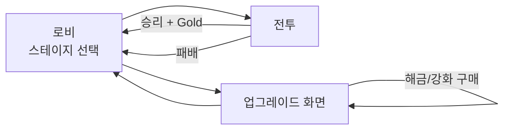

# 메타 루프 기능 명세

> **카테고리:** FEATURES
> **최초 작성:** 2026-03-21
> **최종 갱신:** 2026-03-21
> **관련 기능:** LobbyScene, UpgradeScene, SaveSystem, CurrencySystem, LobbyUI, UpgradeUI

## 개요

전투 외부의 메타 게임 루프를 정의한다. 스테이지 선택, Gold 소비, 유닛 해금, 업그레이드 구매의 전체 흐름을 기술한다.

---

## 메타 루프 전체 흐름



핵심 루프: **전투 → Gold 획득 → 업그레이드 → 더 강해진 전투** 반복. 패배 시에도 Gold 손실이 없으므로 반복 도전이 강제되지는 않지만, 재화 부족으로 인해 자연스럽게 같은 스테이지를 반복하게 된다.

---

## 로비(LobbyScene) 기능 명세

### 화면 구성

| 영역 | 내용 |
|------|------|
| 상단 헤더 | "STAGE SELECT" 타이틀, 현재 보유 Gold |
| 중앙 | 스테이지 버튼 5개 (세로 배열, 간격 100 px) |
| 하단 | 업그레이드 이동 버튼 |

### 스테이지 버튼 상태

| 조건 | 버튼 색상 | 텍스트 | 탭 가능 |
|------|----------|--------|---------|
| 잠김 | `BUTTON_DISABLED` (회색, `0x333333`) | "Stage N 🔒" | X |
| 해금, 미클리어 | `BUTTON_NORMAL` (남색, `0x334466`) | "Stage N" | O |
| 해금, 클리어 완료 | `BUTTON_NORMAL` (남색, `0x334466`) | "Stage N ★ CLEAR" | O |

잠금 조건: `save.clearedStages`에 `stageId - 1`이 없을 때. Stage 1은 항상 해금.

보상 Gold 금액은 버튼 아래 소글자로 표시된다 ("보상: N Gold").

---

## 업그레이드 화면(UpgradeScene) 기능 명세

### 화면 구성

UpgradeScene은 콘텐츠가 화면 높이를 초과하므로 드래그 스크롤로 탐색한다.

| 영역 | 고정 여부 | 내용 |
|------|-----------|------|
| 상단 헤더 | 고정 (`setScrollFactor(0)`) | "업그레이드", 현재 Gold, 뒤로가기 |
| 섹션 1 | 스크롤 | 유닛 해금 (knight, mage, hero) |
| 섹션 2 | 스크롤 | 유닛 강화 (해금된 유닛만 표시) |
| 섹션 3 | 스크롤 | 성 화살 강화 (arrow_dmg, arrow_spd) |

헤더는 `setScrollFactor(0)`으로 카메라 스크롤에 독립적으로 고정된다. depth 20~22로 콘텐츠 위에 항상 렌더링된다.

### 드래그 스크롤 동작

- `pointerdown`에서 드래그 시작점 기록
- `pointermove`에서 Y 이동량을 카메라 scrollY에 반영
- 스크롤 범위: `0` ~ `max(0, totalContentH - screenH + 80)`

### 유닛 해금 행(makeUnlockRow)

| 상태 | 버튼 색상 | 버튼 텍스트 | 탭 가능 |
|------|----------|------------|---------|
| 미해금, Gold 부족 | 빨간 계열 (`0x553333`) | "비용: N Gold" | X |
| 미해금, Gold 충분 | 황갈색 (`0x885500`) | "N G" | O |
| 해금 완료 | 버튼 없음 | "해금 완료" (녹색 텍스트) | - |

### 업그레이드 행(makeUpgradeRow)

| 상태 | 버튼 색상 | 버튼 텍스트 | 탭 가능 |
|------|----------|------------|---------|
| Gold 부족 | 빨간 계열 (`0x553333`) | "N G" | X |
| Gold 충분, 레벨 미달 | 파란 계열 (`0x335599`) | "N G" | O |
| 최대 레벨 (5) | 녹색 계열 (`0x446644`) | "MAX" | X |

### 구매 처리 흐름

```
버튼 탭
    ↓
CurrencySystem.spendGold(cost)
    → false (Gold 부족): 아무 동작 없음
    → true (차감 성공): 계속
    ↓
[해금인 경우]
  save.unlockedUnits.push(unitId)
[강화인 경우]
  save.upgrades[key] = currentLevel + 1
    ↓
SaveSystem.persist()
    ↓
scene.restart()  ← 씬 전체 재시작으로 UI 갱신
```

씬 재시작 방식을 선택한 이유: 개별 버튼 상태를 부분 갱신하려면 각 UI 요소에 대한 참조 관리가 복잡해진다. 씬 재시작은 단순하고 버그 발생 가능성이 낮다. 자세한 내용은 `DOCS/DECISIONS/ADR-002_SAVE_SYSTEM.md` 참조.

---

## 세이브 데이터 구조

`localStorage`의 키 `defense_save`에 JSON 형식으로 저장된다.

```json
{
  "gold": 250,
  "clearedStages": [1, 2],
  "unlockedUnits": ["warrior", "archer", "knight"],
  "upgrades": {
    "warrior_hp": 2,
    "warrior_atk": 1,
    "arrow_dmg": 3
  },
  "heroUsed": false
}
```

| 필드 | 타입 | 기본값 | 설명 |
|------|------|--------|------|
| `gold` | number | 0 | 보유 Gold |
| `clearedStages` | number[] | [] | 클리어한 stageId 목록 |
| `unlockedUnits` | string[] | ["warrior", "archer"] | 해금된 유닛 ID 목록 |
| `upgrades` | object | {} | 업그레이드 키 → 현재 레벨 매핑 (없으면 0레벨로 간주) |
| `heroUsed` | boolean | false | 현재 전투에서 영웅 소환 여부 |

### 세이브 로드 안정성

세이브 로드 시 `Object.assign({}, DEFAULT_SAVE, parsed)` 방식을 사용한다. 신규 필드가 추가되어도 기존 세이브 파일을 그대로 읽을 수 있으며, 누락된 키는 기본값으로 채워진다. JSON 파싱 실패 시 기본값으로 폴백한다.

---

## 결과 화면(ResultScene) 기능 명세

### 승리 화면

| 요소 | 내용 |
|------|------|
| 제목 | "STAGE CLEAR!" (녹색) |
| 부제 | "Stage N 클리어" |
| 보상 | "획득 Gold: N G" (황금색, 굵게) |
| 잔액 | "보유 Gold: N G" |
| 버튼 | 로비로 |

### 패배 화면

| 요소 | 내용 |
|------|------|
| 제목 | "DEFEAT" (빨간색) |
| 메시지 | "성이 함락되었습니다..." |
| 버튼 1 | 재시도 (동일 stageId로 BattleScene 재시작) |
| 버튼 2 | 로비로 |

패배 화면에서 "재시도" 버튼을 탭하면 `scene.start('BattleScene', { stageId })` 로 바로 재전투에 진입한다. 영웅 사용 플래그는 BattleScene.create()에서 초기화되므로 재시도 시 영웅 소환이 다시 가능하다.
