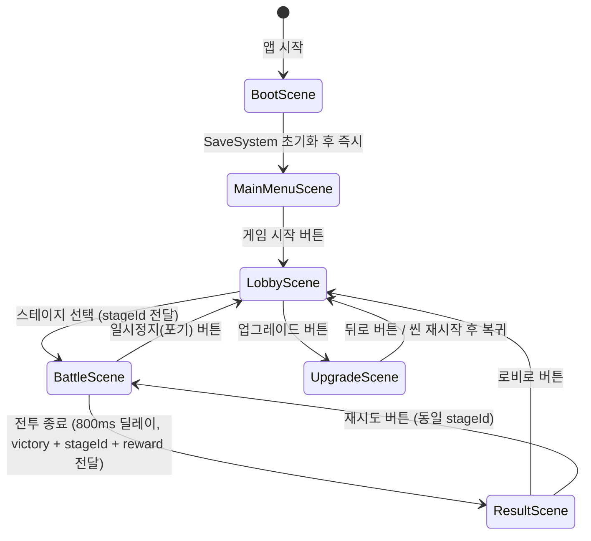
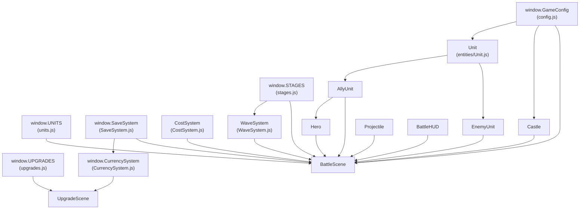

# 시스템 아키텍처

> **카테고리:** SYSTEM
> **최초 작성:** 2026-03-21
> **최종 갱신:** 2026-03-21
> **관련 기능:** 전체 프로젝트 구조, 씬 시스템, 모듈 의존 관계

## 개요

LineBreaker는 Phaser 3 기반의 모바일 2D 디펜스 게임이다. 에셋 파일 없이 Phaser Graphics API만으로 모든 시각 요소를 렌더링하며, `file://` 프로토콜로 직접 실행할 수 있도록 설계되었다. 모든 모듈은 `window.*` 전역 네임스페이스에 등록되어 별도 번들러 없이 `<script>` 태그 순서로 의존성을 관리한다.

---

## 기술 스택

| 항목 | 내용 |
|------|------|
| 렌더링 엔진 | Phaser 3 (CDN: `phaser@3/dist/phaser.min.js`) |
| 언어 | Vanilla JavaScript (ES6 class 문법) |
| 물리 엔진 | 비활성화 — 충돌/거리 계산은 직접 구현 |
| 화면 크기 | 390 × 844 px (세로 모드 고정) |
| 스케일 모드 | `Phaser.Scale.FIT` + `CENTER_BOTH` (기기 크기 자동 맞춤) |
| 저장소 | `localStorage` (키: `defense_save`) |
| 실행 방식 | `index.html` 직접 브라우저 실행 (`file://` 가능) |

---

## 스크립트 로드 순서

`index.html` 내 `<script>` 태그 순서가 곧 의존성 순서다. 이 순서를 변경하면 전역 참조가 `undefined`가 된다.

```
1. config.js           전역 상수 (window.GameConfig)
2. data/
   ├── units.js        유닛 스탯 데이터 (window.UNITS, window.getUnitStats)
   ├── stages.js       스테이지 데이터 (window.STAGES)
   └── upgrades.js     업그레이드 트리 데이터 (window.UPGRADES, window.UNLOCK_COSTS, window.calcUpgradeCost)
3. systems/
   ├── SaveSystem.js   세이브/로드 싱글턴 (window.SaveSystem)
   ├── CurrencySystem.js  골드 관리 — SaveSystem 이후 로드 필수
   ├── CostSystem.js   전투 코스트 클래스
   └── WaveSystem.js   적 소환 타이머 클래스
4. entities/
   ├── Unit.js         유닛 기반 클래스 — 반드시 AllyUnit/EnemyUnit 이전
   ├── AllyUnit.js
   ├── EnemyUnit.js
   ├── Hero.js         AllyUnit 상속 — AllyUnit 이후
   ├── Castle.js
   └── Projectile.js
5. ui/
   ├── BattleHUD.js
   ├── LobbyUI.js
   └── UpgradeUI.js
6. scenes/
   ├── BootScene.js
   ├── MainMenuScene.js
   ├── LobbyScene.js
   ├── BattleScene.js
   ├── UpgradeScene.js
   └── ResultScene.js
7. main.js             Phaser.Game 인스턴스 생성 — 반드시 마지막
```

---

## 씬 구조 및 전환 흐름



### 씬 간 데이터 전달

| 전환 | 전달 데이터 |
|------|------------|
| `LobbyScene` → `BattleScene` | `{ stageId: number }` |
| `BattleScene` → `ResultScene` | `{ victory: boolean, stageId: number, reward: number }` |
| `ResultScene` → `BattleScene` (재시도) | `{ stageId: number }` |

---

## 모듈 의존 관계



---

## 전역 네임스페이스 목록

| 전역 변수 | 타입 | 설명 |
|-----------|------|------|
| `window.GameConfig` | Object | 게임 전역 상수 (화면 크기, 레이아웃, 색상 등) |
| `window.UNITS` | Object | 유닛 ID → 기본 스탯 매핑 |
| `window.getUnitStats` | Function | 업그레이드 적용 스탯 반환 헬퍼 |
| `window.STAGES` | Array | 스테이지별 설정 배열 (인덱스 = stageId - 1) |
| `window.UPGRADES` | Object | 업그레이드 키 → 메타 정보 매핑 |
| `window.UNLOCK_COSTS` | Object | 유닛 해금 비용 매핑 |
| `window.calcUpgradeCost` | Function | 업그레이드 비용 계산 함수 |
| `window.SaveSystem` | Object (IIFE 싱글턴) | 세이브 데이터 로드/저장/초기화 |
| `window.CurrencySystem` | Object (IIFE 싱글턴) | 골드 잔액 조회/추가/차감 |
| `window.CostSystem` | Class | 전투 코스트 관리 (인스턴스 방식) |
| `window.WaveSystem` | Class | 적 소환 타이머 (인스턴스 방식) |
| `window.Unit` | Class | 유닛 기반 클래스 |
| `window.AllyUnit` | Class | 아군 유닛 |
| `window.EnemyUnit` | Class | 적군 유닛 |
| `window.Hero` | Class | 영웅 유닛 (스킬 보유) |
| `window.Castle` | Class | 성 엔티티 |
| `window.Projectile` | Class | 화살 투사체 |
| `window.BattleHUD` | Class | 전투 HUD UI |
| `window.LobbyUI` | Object | 로비 UI 빌더 유틸리티 |
| `window.UpgradeUI` | Object | 업그레이드 UI 빌더 유틸리티 |

---

## 전투 좌표 체계

```
x=0                  x=390
  |  아군 성          |  적군 성
  |  (x=60)          |  (x=330)
  |                  |
  └──────────────────┘
         y=540 (BATTLE_Y: 유닛 이동 라인)
```

- 아군 유닛은 `x=90` (ALLY_CASTLE_X + 30)에서 소환되어 오른쪽(+x)으로 이동
- 적군 유닛은 `x=300` (ENEMY_CASTLE_X - 30)에서 소환되어 왼쪽(-x)으로 이동
- 유닛 `y` 좌표: `BATTLE_Y - stats.radius` (발 위치가 지면 라인에 닿도록)

---

## 렌더링 레이어 (Depth)

| Depth | 내용 |
|-------|------|
| 0 (기본) | 배경, 지면, 성 그래픽 |
| 5 (기본) | 유닛, 투사체 (Container 기본값) |
| 10 | HUD 배경 |
| 11 | HUD 내부 요소 (코스트 바, 버튼 배경) |
| 12 | HUD 텍스트 |
| 13 | HUD 히트존 (클릭 영역) |
| 15 | 일시정지 버튼 |
| 20 | UpgradeScene 고정 헤더 배경 |
| 21 | UpgradeScene 고정 헤더 텍스트 |
| 22 | UpgradeScene 뒤로가기 버튼 |
